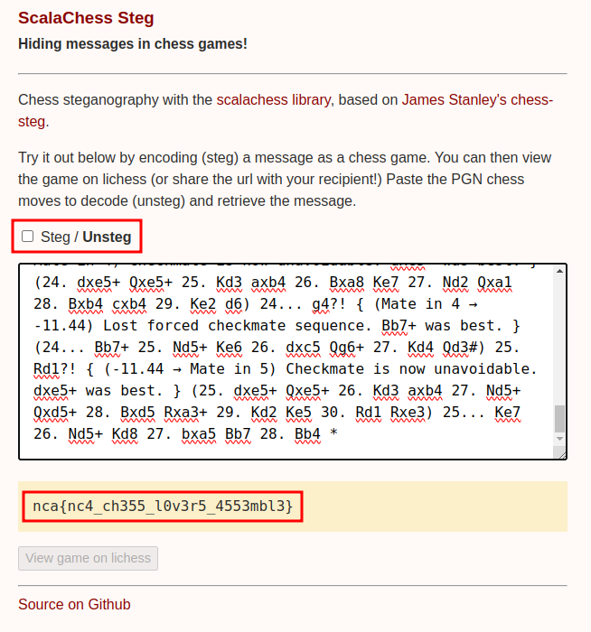

Two players, Ram and Shyam, are playing chess. However, someone whispered that they're not just competing but actually creating a hidden message. Could it be a flag?

This is where they were playing **chess**: https://lichess.org/8HhK4CjV

---
# Flag & Solution
- Few research will lead us to a blog: https://incoherency.co.uk/blog/stories/chess-steg.html

- This chess cipher implementation is used in the CTF challange in this case.

- We can use https://carpetscheme.github.io/scalachess-steg/ which is based on based on James Stanley's chess-steg.

- Just paste the PGN in the above link and we get the flag.

